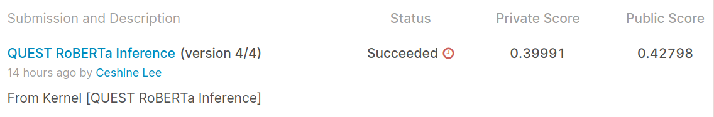

# TPU-Ready TF 2.1 Solution to Google QUEST Q&A Labeling using Siamese RoBERTa Encoder Model

The 5-fold models can be trained in about an hour using Colab TPU. The model performance after post-processing the predictions (to optimize the Spearman correlation to the target):

This is at around 65th place on the private leaderboard. The post-processing (which unfortunately I did not use in the competition) gives an almost 0.03 score boost.

[Inference Kernel on Kaggle](https://www.kaggle.com/ceshine/quest-roberta-inference?scriptVersionId=28553401)

## Train on Colab TPU

[The Notebook](https://gist.github.com/ceshine/752c77742973a013320a9f20384528a1) used the generate the above submission is on Github Gist, and can be opened in Colab.

### Preparation

#### Build the wheels

Run this command in the project root director and in the `tf-helper-bot` subdirectory:

`python setup.py sdist bdist_wheel`

And upload the `.whl` files in the `dist` directory to Google Cloud Storage.

#### Create the TFRecord files

Run this command and then upload the content in `cache/tfrecords` to Google Cloud Storage:

`python -m quest.prepare_tfrecords --model-name roberta-base -n-folds 5`

(Note: check [requirements.txt](requirements.txt) for missing dependencies.)
